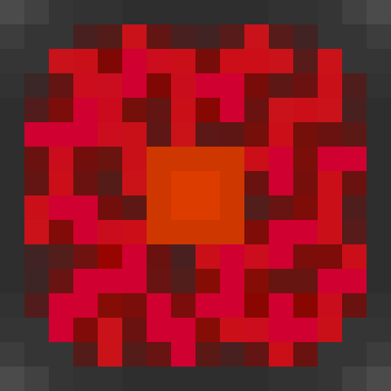

  

<h1 align="center">Reactor</h1>

  <strong>Minecraft: Java Edition cross-play plugin for PowerNukkitX</strong>

  
  
  
  
  

---

## Purpose

Reactor is a PowerNukkitX plugin that enables Minecraft: Java Edition players to join Bedrock Edition servers through Geyser. It aims to provide seamless cross-play support while integrating naturally with the PowerNukkitX ecosystem.

## Features

- Java Edition cross-play support
- Native PowerNukkitX integration
- Easy configuration
- Lightweight and performant
- Open source and community-driven

## Installation

1. Download the latest Reactor release.
2. Place the plugin JAR into your server's `plugins/` directory.
3. Ensure PowerNukkitX is properly installed and configured.
4. Start or restart your server.
5. Configure Reactor using the generated configuration files if needed.

## Requirements

- Java 21 or newer
- PowerNukkitX API 3.x

## Contributing

Contributions are always welcome.

If you'd like to contribute:

1. Fork the repository.
2. Create a feature branch.
3. Make your changes.
4. Submit a Pull Request.

Please follow the project's coding style and keep pull requests focused on a single change whenever possible.

## License

This project is licensed under the **GNU Lesser General Public License v3.0 (LGPL-3.0)**.

See the [LICENSE](LICENSE) file for more information.
